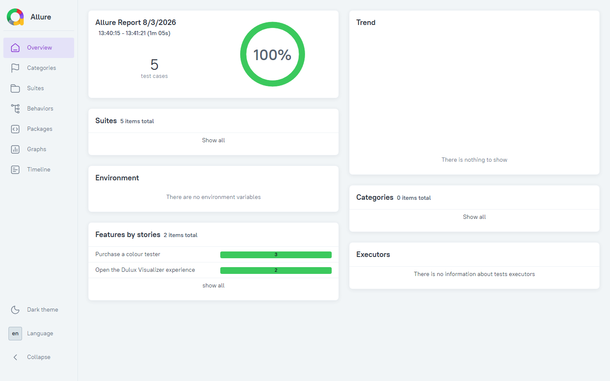

<div align="center">

# 🐍 Playwright Python E2E Automation Framework

### UI end-to-end test automation for [Dulux UK](https://www.dulux.co.uk) — Python · Playwright · pytest-bdd · Allure · CI/CD

[](https://github.com/magdaU/playwright-python-dulux-uk/actions/workflows/e2e-tests.yml)
[](https://github.com/magdaU/playwright-python-dulux-uk/actions/workflows/cross-browser-regression.yml)
[](https://github.com/magdaU/playwright-python-dulux-uk/actions/workflows/nightly-regression.yml)
[](https://www.python.org/)
[](https://playwright.dev/python/)
[](https://docs.pytest.org/)
[](https://pytest-bdd.readthedocs.io/)
[](https://github.com/magdaU/playwright-python-dulux-uk/actions/workflows/e2e-tests.yml)
[](docs/TEST_STRATEGY.md)
[](LICENSE)

</div>

---

## 📖 Overview

Python port of [playwright-java-dulux-uk](https://github.com/magdaU/playwright-java-dulux-uk) — the **same** real Dulux UK customer journeys (buy a colour tester, launch the Visualizer app), the **same** Page Object Model + BDD architecture, a different stack (`pytest-bdd` + plain pytest fixtures instead of Cucumber + PicoContainer DI).

> **Status:** implemented and verified against production — all 5 scenarios pass (desktop + tablet + mobile `purchase`, desktop + mobile `visualizer`).

📚 **Docs:** [Test Strategy](docs/TEST_STRATEGY.md) (what we test, why, scope, risk analysis, roadmap) · [Architecture](docs/ARCHITECTURE.md) (tech stack, design rationale, project structure, a full sample scenario walkthrough).

---

## ✨ Key Features

- 🧱 **Page Object Model + Component Objects**, no assertions in page objects — all `expect()`/`assert` calls live in the step layer.
- 🥒 **BDD with pytest-bdd** — Gherkin `@tag`s become pytest markers automatically, filterable with `-m "smoke"` etc.
- 📱 **Cross-viewport coverage** — `purchase` at desktop/tablet/mobile, `visualizer` at desktop/mobile, via dedicated viewport fixtures.
- ♿ **Accessibility scanning** — `axe-core` on the shade page; known pre-existing production violations are allow-listed by ID so the suite still catches *new* ones.
- 🔁 **Bounded, reported retries** for the one interaction identified as genuinely flaky across browser engines — every attempt logged and attached to the Allure report.
- 🌐 **Cross-browser & nightly regression** — Chromium/Firefox/WebKit on demand, full regression suite scheduled daily against production.
- 📊 **Allure reporting** published to GitHub Pages via CI, plus a 🧹 **ruff** lint/format gate and 🐳 **Docker/Compose** for a reproducible run.

See [Architecture](docs/ARCHITECTURE.md) for the full feature list and the reasoning behind each design choice.

---

## 🎯 Verified against a live catalogue drift

This suite runs against the **real, public production** Dulux site, so it occasionally catches real changes: a shade used in the `purchase` test data was found to have been quietly removed from its colour family mid-project, breaking the scenario. The fix, the cross-check against the Java sibling project, and the (rejected) "self-healing" alternative are documented as a materialised risk in the [Test Strategy §10](docs/TEST_STRATEGY.md#10-risk-analysis--mitigations).

---

## 🚀 Getting Started

### Prerequisites
- **Python 3.12+**
- Internet access (tests run against `dulux.co.uk`)

### Install & run

```bash
python -m venv .venv
.venv/Scripts/activate          # .venv/bin/activate on macOS/Linux
pip install -r requirements.txt
playwright install --with-deps chromium

pytest --collect-only           # confirms scenarios/markers wire up without a browser
pytest -m smoke                 # fast critical-path set
pytest                          # full suite
```

Full marker reference and more CLI examples (cross-browser, headed mode) are in
[Architecture — Tags / markers](docs/ARCHITECTURE.md#tags--markers-reference).

### Run in Docker

```bash
docker compose up --build
PYTEST_MARKERS="regression" docker compose up --build   # a different marker expression
```

Allure results are written back to the host under `./allure-results`.

### Reports

```bash
pytest --alluredir=allure-results
allure serve allure-results
```

In CI, the report is generated automatically and published to GitHub Pages on every push
to `main`. A real run of the full suite, rendered locally from this repo's own Allure
output:



---

## 👩‍💻 Author

**Magdalena Ukleja**

[](https://github.com/magdaU)

QA Automation Engineer — Python · Java · Playwright · BDD · CI/CD.
