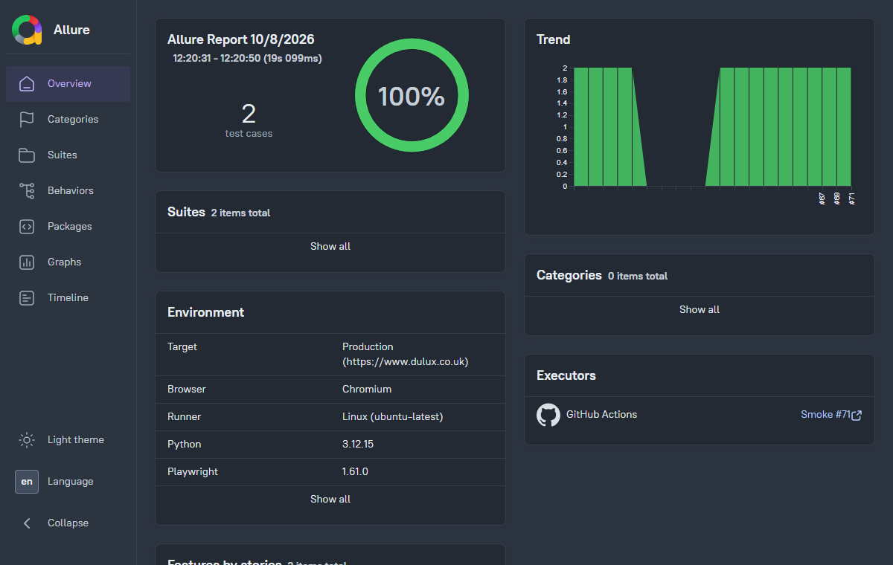

<div align="center">

# 🐍 Playwright Python E2E Automation Framework

### UI end-to-end test automation for [Dulux UK](https://www.dulux.co.uk) — Python · Playwright · pytest-bdd · Allure · CI/CD

[](https://github.com/magdaU/playwright-python-dulux-uk/actions/workflows/e2e-tests.yml)
[](https://github.com/magdaU/playwright-python-dulux-uk/actions/workflows/cross-browser-regression.yml)
[](https://github.com/magdaU/playwright-python-dulux-uk/actions/workflows/nightly-regression.yml)
[](https://magdau.github.io/playwright-python-dulux-uk/smoke/)
[](https://magdau.github.io/playwright-python-dulux-uk/nightly/)
[](LICENSE)

</div>

---

## 📖 Overview

Python port of [playwright-java-dulux-uk](https://github.com/magdaU/playwright-java-dulux-uk) — real Dulux UK customer journeys (buy a colour tester, launch the Visualizer app), tested with a Page Object Model + BDD architecture built on `pytest-bdd`, Playwright and Allure.

---

## 📊 Test Reports

Allure reports are published to GitHub Pages by CI — two reports, two purposes (both linked from the [reports landing page](https://magdau.github.io/playwright-python-dulux-uk/)):

| Report | Updated | Covers |
|---|---|---|
| [**Smoke report**](https://magdau.github.io/playwright-python-dulux-uk/smoke/) | on every merge to `main` | the 18 `@smoke` tests (17 scenarios) — the fast, every-push gate |
| [**Nightly regression report**](https://magdau.github.io/playwright-python-dulux-uk/nightly/) | daily, and on manual run | all 34 `@regression` test cases against production — purchase, basket edit, boundary values, negative paths, search, cookie consent and the Visualizer |

Each report links back to the CI run that produced it (*Executors* widget) and groups any
failure into a category — catalogue drift, accessibility, infrastructure, product or test defect.
Tests are organised in the report as epic → feature → story (Behaviors) and viewport → feature (Suites),
carry a severity (from the priority in
[Test Cases](docs/TEST_CASES.md)), an owner and a link to their TC-xx write-up.
A failed test also carries a full-page screenshot and the page URL, so it can be diagnosed
without re-running it against production.

<div align="center">

<a href="https://magdau.github.io/playwright-python-dulux-uk/smoke/"></a>

<sub>Smoke report overview (the nightly report has the same layout).</sub>

</div>

---

## 🧰 Tech Stack

| Tool | Version | Purpose |
|---|---|---|
| Python | 3.12 | Language |
| Playwright | 1.61 | Browser automation (Chromium, Firefox, WebKit) |
| pytest / pytest-playwright | 9.1 / 0.8 | Test runner + browser/context/page fixtures |
| pytest-bdd | 8.1 | BDD layer — Gherkin feature files → pytest test items |
| Allure (`allure-pytest-bdd`) | 2.16 | Test reporting with Gherkin step rendering |
| axe-playwright-python | 0.1.8 | Accessibility scanning (`axe-core`) |
| ruff | 0.16 | Linting + formatting, enforced in CI |
| Docker / Docker Compose | – | Containerised, reproducible test runs |
| GitHub Actions | – | CI/CD pipeline, GitHub Pages |

Full rationale for each choice (and how it compares to the Java sibling project) is in
[Architecture — Tech stack](docs/ARCHITECTURE.md#tech-stack).

---

## 🏛 Architecture

**Page Object Model + Component Objects**, with **no assertions inside page objects** —
pages only act and expose locators; every `expect()`/`assert` lives in the step layer.
Scenarios are written in Gherkin (`features/`) and bound to Playwright actions via
`pytest-bdd` step definitions (`tests/step_defs/`); a per-scenario `Context` object
(`support/context.py`) plays the role a DI container plays in the Java sibling project,
using plain pytest fixtures instead.

```
features/            Gherkin scenarios (business-readable)
pages/                Page objects + reusable components (navigation, alerts)
support/context.py    Business-level methods used by step defs, one instance per scenario
tests/step_defs/      Step definitions binding Gherkin steps to Context/page-object calls
conftest.py            desktop_page / tablet_page / mobile_page viewport fixtures
```

Full project structure, the design rationale behind each choice, and a complete sample
scenario walkthrough: [Architecture](docs/ARCHITECTURE.md).

---

## 📚 Docs

- 📊 Reports: [smoke](https://magdau.github.io/playwright-python-dulux-uk/smoke/) · [nightly regression](https://magdau.github.io/playwright-python-dulux-uk/nightly/)
- [Getting Started](docs/GETTING_STARTED.md) — what this project is, what it demonstrates, prerequisites, install & run, day-to-day developer/tester workflow.
- [Features Guide](docs/FEATURES_GUIDE.md) — a functional walkthrough of the site areas under test.
- [Test Strategy](docs/TEST_STRATEGY.md) — what we test, why, scope, risk analysis, coverage gaps, roadmap.
- [Test Plan](docs/TEST_PLAN.md) · [Test Cases](docs/TEST_CASES.md) · [Test Results](docs/TEST_RESULTS.md) · [Test Summary Report](docs/TEST_SUMMARY_REPORT.md) — the supporting QA artifacts for this suite.
- [Architecture](docs/ARCHITECTURE.md) — tech stack, design rationale, project structure, a full sample scenario walkthrough.
- [Lessons Learned](docs/LESSONS_LEARNED.md) — real production incidents this suite caught, root-caused and fixed.
- [Testing Without Requirements](docs/TESTING_WITHOUT_REQUIREMENTS.md) — how test scope is derived with no internal spec available.

---

## 👩‍💻 Author

**Magdalena Ukleja**

[](https://github.com/magdaU)

QA Automation Engineer — Python · Java · Playwright · BDD · CI/CD.
